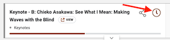
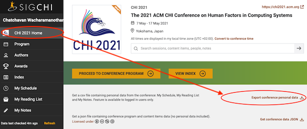
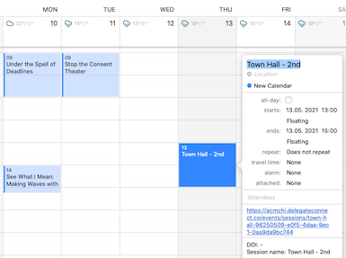

In the [CHI 2021 program web app](https://programs.sigchi.org/chi/2021/program), mark the sessions that you are interseted in by clicking on the clock button:

Then, export your schedule by going to the "CHI 2021 Home" page and click "Export conference personal data".

You wil receive a CSV file to be uploaded below. After processing, you can download .ics file for each day or all days. On a mac, double click the file to import to your Calendar app. (Instruction for [Google Calendar](https://support.google.com/calendar/answer/37118?co=GENIE.Platform%3DDesktop&hl=en) and [MS Outlook](https://support.microsoft.com/en-us/office/import-calendars-into-outlook-8e8364e1-400e-4c0f-a573-fe76b5a2d379)) Each calendar entry contains the link to the session on Delegate Connect, DOI to the paper, and the notes you made on the CHI program web app.

--------